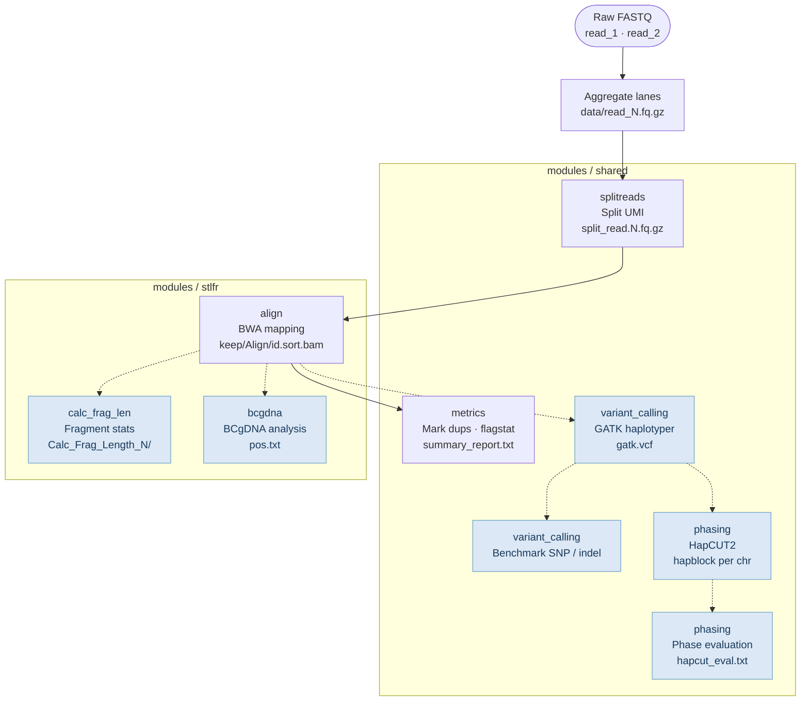
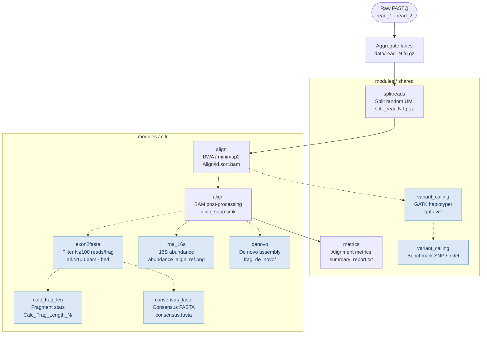

# CGI LFR Pipeline
 
This pipeline is for various CGI LFR (stLFR: Single Tube Long Fragment Read and cLFR: Complete LFR) DNA sequencing applications, with a focus on QC and assay development troubleshooting.   
It is a refactor of the legacy CGI LFR/WGS pipeline focused on resolving technical debt, improving maintainability, and making workflow behavior easier to reproduce.  
For production pipeline, see [cWGS](https://github.com/Complete-Genomics/DNBSEQ_Complete_WGS/tree/test?tab=readme-ov-file).  

## Background

The stLFR/cLFR technology co-barcodes short reads from the same long DNA fragment for both CoolMPS and StandardMPS sequencing. By clustering reads sharing the same barcode, it delivers pseudo-long-read resolution at the cost of standard short-read sequencing. This positions it as an attractive, cost-effective alternative for large-scale production WGS, bridging the gap between conventional Illumina short reads and more expensive long-read platforms like PacBio.


## Directory Structure

The pipeline refactored [CGI_WGS_pipeline](https://github.com/Complete-Genomics/CGI_WGS_Pipeline), expanding scope of the stLFR data, while supporting newly developed cLFR data.  

```
CGI_LFR_pipeline/
│
├── workflows/              # pipeline entry points
│   ├── stlfr.smk           # stLFR entry point
│   └── clfr.smk            # cLFR entry point
│
├── modules/                # rules and scripts co-located by function
│   ├── shared/             # modules shared by stLFR and cLFR
│   │   ├── splitreads/     # UMI splitting (stLFR + cLFR)
│   │   ├── metrics/        # alignment metrics, GC bias, summary report
│   │   ├── variant_calling/# GATK variant calling
│   │   ├── phasing/        # HapCUT2 haplotype phasing (stLFR)
│   ├── stlfr/              # stLFR-specific modules
│   │   ├── align/          # BWA alignment
│   │   ├── calc_frag_len/  # fragment length statistics
│   │   └── bcgdna/         # BCgDNA troubleshooting
│   └── clfr/               # cLFR-specific modules
│       ├── align/          # BWA / minimap2 alignment
│       ├── calc_frag_len/  # fragment length statistics
│       ├── exon2fasta/     # N≥100 reads/fragment filter + coverage analysis
│       ├── consensus_fasta/# mRNA isoform consensus FASTA
│       ├── rna_16s/        # 16S rRNA abundance analysis
│       └── denovo/         # per-fragment de novo assembly
│
├── config/
│   ├── stlfr.yaml          # stLFR default config
│   └── clfr.yaml           # cLFR default config
│
└── example/
    ├── fastq/batch_name/   # raw FASTQ input
    └── analysis/config.yaml
```

## Pipeline Workflows

Both pipelines share a common read-processing entry and diverge at the mapping stage.
Nodes are grouped by `modules/` subdirectory. Optional modules (blue) are toggled via `config/stlfr.yaml` or `config/clfr.yaml`.

### stLFR Workflow

Entry point: `workflows/stlfr.smk` · Config: `config/stlfr.yaml`



### cLFR Workflow

Entry point: `workflows/clfr.smk` · Config: `config/clfr.yaml`



## Quick start

1. modify config.yaml  
2. excute run_lfr.sh  


## Reference
1. [stLFR](https://www.ncbi.nlm.nih.gov/pmc/articles/PMC6499310/)  
A DNA cobarcoding technique  
2. [cWGS (A production pipeline for stLFR)](https://github.com/Complete-Genomics/DNBSEQ_Complete_WGS/tree/test?tab=readme-ov-file)  
A deep learning-based variant caller  
3. [Hapcut2](https://github.com/vibansal/HapCUT2)  
A haplotype assembly tool
 
