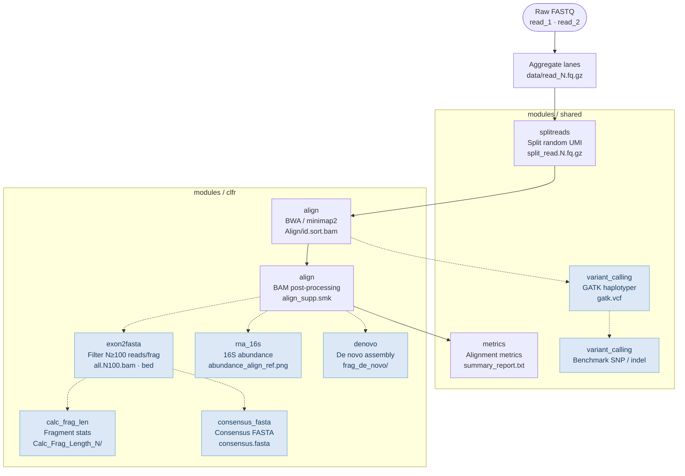

# CGI LFR Pipeline
 
This pipeline is for various CGI LFR (stLFR: Single Tube Long Fragment Read and cLFR: Complete LFR) DNA sequencing applications, with a focus on QC and assay development troubleshooting.   
It is a refactor of the legacy CGI LFR/WGS pipeline focused on resolving technical debt, improving maintainability, and making workflow behavior easier to reproduce.  
For production pipeline, see [cWGS](https://github.com/Complete-Genomics/DNBSEQ_Complete_WGS/tree/test?tab=readme-ov-file).  

## Background

The stLFR/cLFR technology co-barcodes short reads from the same long DNA fragment for both CoolMPS and StandardMPS sequencing. By clustering reads sharing the same barcode, it delivers pseudo-long-read resolution at the cost of standard short-read sequencing. This positions it as an attractive, cost-effective alternative for large-scale production WGS, bridging the gap between conventional Illumina short reads and more expensive long-read platforms like PacBio.

## Key Engineering Highlights

### De novo assembly tuned for per-UMI reconstruction (`modules/clfr/denovo/`)

Each cLFR UMI barcodes the reads from a single short DNA fragment (typically hundreds of bp to a few kb) — a very different regime from genome- or metagenome-scale assembly, and one built around single-end 600bp (SE600) reads rather than short paired-end reads. `denovo_seed_olc.py` implements a lightweight greedy Overlap-Layout-Consensus (OLC) assembler purpose-built for this regime, as an alternative to the de Bruijn graph approach (megahit, k=41) used previously. Released standalone as a tech notes [denovo_OLC](https://github.com/Complete-Genomics/denovo_OLC), which covers the full design in depth; highlights:

- **OLC fits the per-UMI problem shape better than a de Bruijn graph.** A de Bruijn graph pays a fixed k-mer-indexing/graph-construction cost that only pays for itself when amortized over genome-scale read depth — at 3M+ UMIs with typically single- to low-double-digit reads each, that fixed cost dominates while the graph abstraction buys little a direct greedy overlap search doesn't already give for free. OLC also degrades gracefully at the lowest depths (down to a single read → a contig, if it clears the length floor), where a de Bruijn graph has no redundancy to build a connected component from at all.
- **Tuned specifically for 16S rRNA barcode data on SE600 reads.** Real 16S reads carry universally-conserved primer regions that can masquerade as overlap signal, plus PCR-chimera artifacts and quality-degraded stretches fused onto otherwise-accurate reads that ordinary boundary-only overlap detection structurally cannot see. A bidirectional internal-anchor fallback locates a real, sufficiently long anchor anywhere inside a read rather than only at its literal ends, recovering contigs boundary-based overlap alone would miss or truncate; a collective pileup-rescue mechanism (with evidence shared across greedy build attempts) additionally handles the case where two reads' independent sequencing errors combine and push an otherwise-valid overlap past the mismatch threshold. Validated against a mock community with fully known reference sequences: post-QC mean identity of 95.4–97.1% depending on preset (breadth- vs. purity-optimized), measured directly against the true references rather than assumed from community-composition plausibility.
- **SE600-specific adapter/index/barcode read-through detection.** A 600bp single-end read routinely reads past a shorter physical insert into ligation adapter, sample index, and — in rolling-circle-amplified library preps — back into the barcode itself; left untrimmed this technical sequence gets assembled as if it were biological, inflating contig length and fragmenting what should be one contiguous assembly. Identified via reference-free forensic analysis (positional-invariance testing, abundance-matched conserved-region controls, cross-referencing against reference sequence databases) on real production data, distinguishing genuine adapter contamination from true biological conserved regions.
- **Algorithm and data-structure work to make it production-viable at 3M-UMI scale.** A per-UMI boundary k-mer inverted index turns candidate discovery from a full-pool rescan into an output-sensitive lookup, cutting a documented worst-case single-UMI runtime from 100.2s to 5.07s (11.7×) with byte-for-byte identical output to the unindexed baseline. Deterministic-by-construction tie-breaking eliminates a subtle non-reproducibility bug from Python's per-process string-hash randomization. Multiprocessing uses `Pool(initializer=...)` rather than `mp.Manager()` (no per-barcode IPC round trip), correctly propagates configuration under both `fork` and `spawn` start methods, and schedules with a chunksize tuned for the heterogeneous per-barcode cost distribution real data actually has.
- **Reference-free chimera detection by verified-spanning-depth collapse.** A UMI's read pool can end up mixing reads from more than one source molecule upstream of assembly; the assembler's own overlap logic can then bridge them through a short shared motif into a chimeric contig that looks perfectly healthy by ordinary coverage, since every read genuinely belongs to that barcode — naive read-back consistency checking cannot see this at all. Checking *verified* spanning depth (reads crossing a position with real two-sided identity, not just k-mer placement) does: a true chimera junction collapses this signal sharply while ordinary coverage stays healthy. Measured at AUC 0.827 for chimera discrimination against a mock-community control with fully known reference sequences, where naive read-back consistency and an off-the-shelf reference-free chimera detector both perform at or near chance.
- **QC strength picked per run from the sample's own data, not declared by the operator.** What fragment-yield/accuracy trade-off is worth paying for depends heavily on sample diversity. A lightweight probe measures the run's own cross-barcode sequence-identity distribution (different barcodes are, by construction, different source molecules, so this is a built-in reference-free negative control) and selects an appropriate QC preset automatically, with the decision logged for audit. Every preset's trade-off is measured against the same mock-community ground truth, not assumed — and several plausible-sounding alternatives (whole-UMI removal for suspected mixing, indel-tolerant overlap scoring, homopolymer-aware assembly) were implemented and rejected when they did not measurably help.

### Reference-guided consensus for mRNA isoform analysis (`modules/clfr/consensus_fasta/`)

When a reference is available (e.g. a known species or transcriptome), `consensus_fasta.py` builds a per-UMI consensus by aligning each fragment's reads to the reference and calling a position-level pileup consensus (via `samtools consensus`), instead of assembling from scratch (Released standalone as [consensus_fasta](https://github.com/Complete-Genomics/cLFR_Release)):

- **Faster than de novo assembly whenever a reference exists** — alignment plus pileup skips graph/overlap construction entirely, since the reference already supplies the structure.
- **Still preserves real SNVs relative to the reference** — the consensus is called from each fragment's own read pileup, not substituted with reference sequence, so sample-specific variants aren't silently lost.


## Directory Structure

The pipeline refactored [CGI_WGS_pipeline](https://github.com/Complete-Genomics/CGI_WGS_Pipeline), expanding scope of the stLFR data, while supporting newly developed cLFR data.  

```
CGI_LFR_pipeline/
│
├── workflows/              # pipeline entry points
│   ├── stlfr.smk           # stLFR entry point
│   └── clfr.smk            # cLFR entry point
│
├── modules/                # rules and scripts co-located by function
│   ├── shared/             # modules shared by stLFR and cLFR
│   │   ├── splitreads/     # UMI splitting (stLFR + cLFR)
│   │   ├── metrics/        # alignment metrics, GC bias, summary report
│   │   ├── variant_calling/# GATK variant calling
│   │   ├── phasing/        # HapCUT2 haplotype phasing (stLFR)
│   ├── stlfr/              # stLFR-specific modules
│   │   ├── align/          # BWA alignment
│   │   ├── calc_frag_len/  # fragment length statistics
│   │   └── bcgdna/         # BCgDNA troubleshooting
│   └── clfr/               # cLFR-specific modules
│       ├── align/          # BWA / minimap2 alignment
│       ├── calc_frag_len/  # fragment length statistics
│       ├── exon2fasta/     # N≥100 reads/fragment filter + coverage analysis
│       ├── consensus_fasta/# mRNA isoform consensus FASTA
│       ├── rna_16s/        # 16S rRNA abundance analysis
│       └── denovo/         # per-fragment de novo assembly
│
├── config/
│   ├── stlfr.yaml          # stLFR default config
│   └── clfr.yaml           # cLFR default config
│
└── example/
    ├── fastq/batch_name/   # raw FASTQ input
    └── analysis/config.yaml
```

## Pipeline Workflows

Both pipelines share a common read-processing entry and diverge at the mapping stage.
Nodes are grouped by `modules/` subdirectory. Optional modules (blue) are toggled via `config/stlfr.yaml` or `config/clfr.yaml`.

### stLFR Workflow

Entry point: `workflows/stlfr.smk` · Config: `config/stlfr.yaml`


```mermaid
flowchart TD
    raw(["Raw FASTQ\nread_1 · read_2"])
    agg["Aggregate lanes\ndata/read_N.fq.gz"]

    subgraph SH["modules / shared"]
        split["splitreads\nSplit UMI\nsplit_read.N.fq.gz"]
        met["metrics\nMark dups · flagstat\nsummary_report.txt"]
        vc["variant_calling\nGATK haplotyper\ngatk.vcf"]
        bench["variant_calling\nBenchmark SNP / indel"]
        phase["phasing\nHapCUT2\nhapblock per chr"]
        pheval["phasing\nPhase evaluation\nhapcut_eval.txt"]
    end

    subgraph ST["modules / stlfr"]
        map["align\nBWA mapping\nkeep/Align/id.sort.bam"]
        frag["calc_frag_len\nFragment stats\nCalc_Frag_Length_N/"]
        bcgdna["bcgdna\nBCgDNA analysis\npos.txt"]
    end

    raw --> agg --> split --> map
    map --> met
    map -.-> frag
    map -.-> vc
    vc -.-> bench
    vc -.-> phase -.-> pheval
    map -.-> bcgdna

    classDef opt fill:#dce8f5,stroke:#6ca3c8,color:#1a3a5c
    class frag,vc,bench,phase,pheval,bcgdna opt
```

### cLFR Workflow

Entry point: `workflows/clfr.smk` · Config: `config/clfr.yaml`


```mermaid
flowchart TD
    raw(["Raw FASTQ\nread_1 · read_2"])
    agg["Aggregate lanes\ndata/read_N.fq.gz"]

    subgraph SH["modules / shared"]
        split["splitreads\nSplit random UMI\nsplit_read.N.fq.gz"]
        met["metrics\nAlignment metrics\nsummary_report.txt"]
        vc["variant_calling\nGATK haplotyper\ngatk.vcf"]
        bench["variant_calling\nBenchmark SNP / indel"]
    end

    subgraph CL["modules / clfr"]
        map["align\nBWA / minimap2\nAlign/id.sort.bam"]
        supp["align\nBAM post-processing\nalign_supp.smk"]
        exon["exon2fasta\nFilter N≥100 reads/frag\nall.N100.bam · bed"]
        frag["calc_frag_len\nFragment stats\nCalc_Frag_Length_N/"]
        consensus["consensus_fasta\nConsensus FASTA\nconsensus.fasta"]
        rna["rna_16s\n16S abundance\nabundance_align_ref.png"]
        denovo["denovo\nDe novo assembly\nfrag_de_novo/"]
    end

    raw --> agg --> split --> map
    map --> supp --> met
    supp -.-> exon
    exon -.-> frag
    exon -.-> consensus
    supp -.-> rna
    supp -.-> denovo
    map -.-> vc
    vc -.-> bench

    classDef opt fill:#dce8f5,stroke:#6ca3c8,color:#1a3a5c
    class exon,frag,consensus,rna,denovo,vc,bench opt
```

## Installation

For server-to-server deployment, prefer an explicit conda package spec exported
from a working server environment. This avoids solver drift from a full
`conda env export` file, which can include low-level ABI pins that may conflict
on another server even with the same Linux architecture.

On the source server:

```bash
conda list --explicit > lfr_pipeline.explicit.txt
```

On the target server:

```bash
mamba create -n lfr_pipeline --file lfr_pipeline.explicit.txt
mamba activate lfr_pipeline
```

For new installs where exact package reproduction is not required, use
`config/env.yml` as the top-level dependency specification.

## Quick start

1. Modify `config.yaml`.
2. Execute `run_lfr.sh`.


## Reference
1. [stLFR](https://www.ncbi.nlm.nih.gov/pmc/articles/PMC6499310/)  
A DNA cobarcoding technique  
2. [cWGS (A production pipeline for stLFR)](https://github.com/Complete-Genomics/DNBSEQ_Complete_WGS/tree/test?tab=readme-ov-file)  
A deep learning-based variant caller  
3. [Hapcut2](https://github.com/vibansal/HapCUT2)  
A haplotype assembly tool
 
