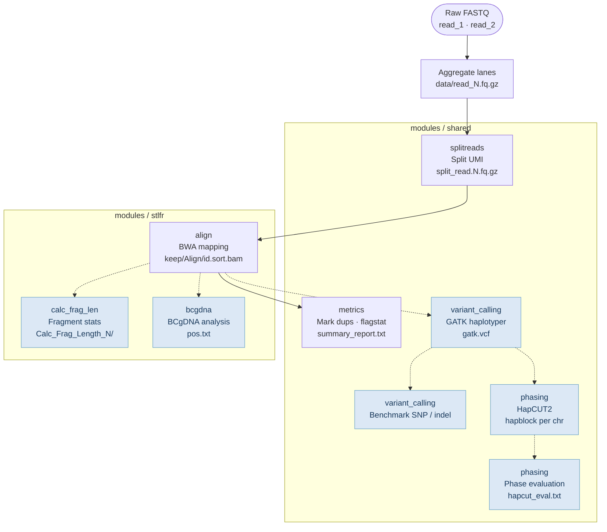

# CGI LFR Pipeline
 
This pipeline is for various CGI LFR (stLFR: Single Tube Long Fragment Read and cLFR: Complete LFR) DNA sequencing applications, with a focus on cLFR.   
It is a refactor of the legacy CGI LFR/WGS pipeline focused on resolving technical debt, improving QC, maintainability, and making workflow behavior easier to reproduce.  
For production stLFR pipeline, see [cWGS](https://github.com/Complete-Genomics/DNBSEQ_Complete_WGS/tree/test?tab=readme-ov-file).  

## Background

The stLFR/cLFR technology co-barcodes short reads from the same long DNA fragment for both CoolMPS and StandardMPS sequencing. By clustering reads sharing the same barcode, it delivers pseudo-long-read resolution at the cost of standard short-read sequencing. This positions it as an attractive, cost-effective alternative for large-scale production WGS, bridging the gap between conventional Illumina short reads and more expensive long-read platforms like PacBio.

## Key Production Highlights

### De novo assembly tuned for per-UMI reconstruction 
(`modules/clfr/denovo/`)

Each cLFR UMI barcodes the reads from a single short DNA fragment — a different regime from genome-scale assembly, built around single-end 600bp (SE600) reads rather than paired-end. `denovo_seed_olc.py` implements a lightweight greedy Overlap-Layout-Consensus (OLC) assembler for this regime, replacing a prior de Bruijn graph (megahit, k=41) approach. Full design at [denovo_OLC](https://github.com/Complete-Genomics/denovo_OLC); highlights:

- **OLC over de Bruijn graph for this problem shape** — no fixed graph-construction cost to amortize at the single- to low-double-digit read depths typical per UMI, and degrades gracefully down to a single read (→ a contig, if it clears the length floor), where a de Bruijn graph has no redundancy to work with at all.
- **Tuned for 16S/SE600-specific noise** — internal-anchor and collective pileup-rescue fallbacks recover overlaps that conserved primer regions, PCR-chimera artifacts, and combined independent read errors would otherwise block. Validated against a mock community with fully known reference sequences: 95.4–97.1% mean identity depending on QC preset, measured directly against the true references.
- **Adapter/index/barcode read-through detection** — a 600bp read routinely reads past the physical insert into adapter, sample index, or (in rolling-circle-amplified preps) the barcode itself; reference-free forensic analysis distinguishes genuine adapter contamination from true biological conserved sequence.
- **Engineered for 3M-UMI scale** — a boundary k-mer inverted index cut a documented worst-case single-UMI runtime from 100.2s to 5.07s; deterministic-by-construction output; `fork`/`spawn`-correct multiprocessing scheduled for the heavy-tailed per-barcode cost distribution real data has.
- **Reference-free QC** — chimera detection by verified-spanning-depth collapse (AUC 0.827 against mock-community ground truth, where naive read-back checks and off-the-shelf detectors perform near chance), plus a diversity-adaptive QC preset chosen per run from the sample's own cross-barcode identity distribution and logged for audit.

### Reference-guided consensus for mRNA isoform analysis 
(`modules/clfr/consensus_fasta/`)

When a reference is available (e.g. a known species or transcriptome), `consensus_fasta.py` builds a per-UMI consensus by aligning each fragment's reads to the reference and calling a position-level pileup consensus (via `samtools consensus`), instead of assembling from scratch (Released standalone as [consensus_fasta](https://github.com/Complete-Genomics/cLFR_Release)):

- **Faster than de novo assembly whenever a reference exists** — alignment plus pileup skips graph/overlap construction entirely, since the reference already supplies the structure.
- **Still preserves real SNVs relative to the reference** — the consensus is called from each fragment's own read pileup, not substituted with reference sequence, so sample-specific variants aren't silently lost.


## Directory Structure  

```
CGI_LFR_pipeline/
│
├── workflows/              # pipeline entry points
│   ├── stlfr.smk           # stLFR entry point
│   └── clfr.smk            # cLFR entry point
│
├── modules/                # rules and scripts co-located by function
│   ├── shared/             # modules shared by stLFR and cLFR
│   │   ├── splitreads/     # UMI splitting (stLFR + cLFR)
│   │   ├── metrics/        # alignment metrics, GC bias, summary report
│   │   ├── variant_calling/# GATK variant calling
│   │   ├── phasing/        # HapCUT2 haplotype phasing (stLFR)
│   ├── stlfr/              # stLFR-specific modules
│   │   ├── align/          # BWA alignment
│   │   ├── calc_frag_len/  # fragment length statistics
│   │   └── bcgdna/         # BCgDNA troubleshooting
│   └── clfr/               # cLFR-specific modules
│       ├── align/          # BWA / minimap2 alignment
│       ├── calc_frag_len/  # fragment length statistics
│       ├── exon2fasta/     # N≥100 reads/fragment filter + coverage analysis
│       ├── consensus_fasta/# mRNA isoform consensus FASTA
│       ├── rna_16s/        # 16S rRNA abundance analysis
│       └── denovo/         # per-fragment de novo assembly
│
├── config/
│   ├── stlfr.yaml          # stLFR default config
│   └── clfr.yaml           # cLFR default config
│
└── example/
    ├── fastq/batch_name/   # raw FASTQ input
    └── analysis/config.yaml
```

## Pipeline Workflows

Both pipelines share a common read-processing entry and diverge at the mapping stage.
Nodes are grouped by `modules/` subdirectory. Optional modules (blue) are toggled via `config/stlfr.yaml` or `config/clfr.yaml`.

### stLFR Workflow

Entry point: `workflows/stlfr.smk` · Config: `config/stlfr.yaml`


```mermaid
flowchart TD
    raw(["Raw FASTQ\nread_1 · read_2"])
    agg["Aggregate lanes\ndata/read_N.fq.gz"]

    subgraph SH["modules / shared"]
        split["splitreads\nSplit UMI\nsplit_read.N.fq.gz"]
        met["metrics\nMark dups · flagstat\nsummary_report.txt"]
        vc["variant_calling\nGATK haplotyper\ngatk.vcf"]
        bench["variant_calling\nBenchmark SNP / indel"]
        phase["phasing\nHapCUT2\nhapblock per chr"]
        pheval["phasing\nPhase evaluation\nhapcut_eval.txt"]
    end

    subgraph ST["modules / stlfr"]
        map["align\nBWA mapping\nkeep/Align/id.sort.bam"]
        frag["calc_frag_len\nFragment stats\nCalc_Frag_Length_N/"]
        bcgdna["bcgdna\nBCgDNA analysis\npos.txt"]
    end

    raw --> agg --> split --> map
    map --> met
    map -.-> frag
    map -.-> vc
    vc -.-> bench
    vc -.-> phase -.-> pheval
    map -.-> bcgdna

    classDef opt fill:#dce8f5,stroke:#6ca3c8,color:#1a3a5c
    class frag,vc,bench,phase,pheval,bcgdna opt
```

### cLFR Workflow

Entry point: `workflows/clfr.smk` · Config: `config/clfr.yaml`


```mermaid
flowchart TD
    raw(["Raw FASTQ\nread_1 · read_2"])
    agg["Aggregate lanes\ndata/read_N.fq.gz"]

    subgraph SH["modules / shared"]
        split["splitreads\nSplit random UMI\nsplit_read.N.fq.gz"]
        met["metrics\nAlignment metrics\nsummary_report.txt"]
        vc["variant_calling\nGATK haplotyper\ngatk.vcf"]
        bench["variant_calling\nBenchmark SNP / indel"]
    end

    subgraph CL["modules / clfr"]
        map["align\nBWA / minimap2\nAlign/id.sort.bam"]
        supp["align\nBAM post-processing\nalign_supp.smk"]
        exon["exon2fasta\nFilter N≥100 reads/frag\nall.N100.bam · bed"]
        frag["calc_frag_len\nFragment stats\nCalc_Frag_Length_N/"]
        consensus["consensus_fasta\nConsensus FASTA\nconsensus.fasta"]
        rna["rna_16s\n16S abundance\nabundance_align_ref.png"]
        denovo["denovo\nDe novo assembly\nfrag_de_novo/"]
    end

    raw --> agg --> split --> map
    map --> supp --> met
    supp -.-> exon
    exon -.-> frag
    exon -.-> consensus
    supp -.-> rna
    supp -.-> denovo
    map -.-> vc
    vc -.-> bench

    classDef opt fill:#dce8f5,stroke:#6ca3c8,color:#1a3a5c
    class exon,frag,consensus,rna,denovo,vc,bench opt
```

## Installation

For server-to-server deployment, prefer an explicit conda package spec exported
from a working server environment. This avoids solver drift from a full
`conda env export` file, which can include low-level ABI pins that may conflict
on another server even with the same Linux architecture.

On the source server:

```bash
conda list --explicit > lfr_pipeline.explicit.txt
```

On the target server:

```bash
mamba create -n lfr_pipeline --file lfr_pipeline.explicit.txt
mamba activate lfr_pipeline
```

For new installs where exact package reproduction is not required, use
`config/env.yml` as the top-level dependency specification.

## Quick start

1. Modify `config.yaml`.
2. Execute `run_lfr.sh`.


## Reference
1. [stLFR](https://www.ncbi.nlm.nih.gov/pmc/articles/PMC6499310/)  
A DNA cobarcoding technique  
2. [cWGS (A production pipeline for stLFR)](https://github.com/Complete-Genomics/DNBSEQ_Complete_WGS/tree/test?tab=readme-ov-file)  
A deep learning-based variant caller  
3. [Hapcut2](https://github.com/vibansal/HapCUT2)  
A haplotype assembly tool
 
